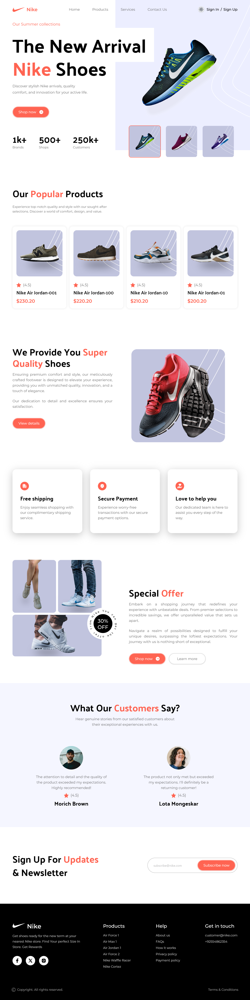
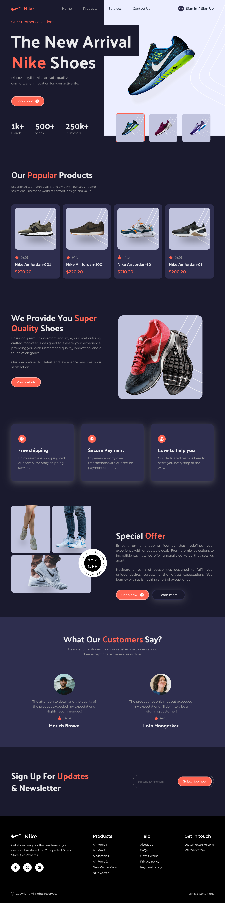
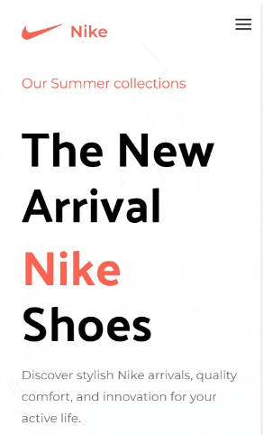
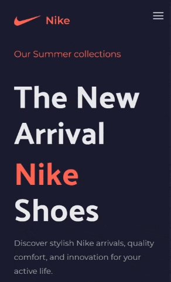

# React + Tailwind CSS 4 + Vite

This is a Nike-themed SPA built with React 19 & Vite, tailored for practicing Tailwind CSS 4.

## <a name="acknowledgment">🚀 Acknowledgment</a>

Thanks [@Adrian and JS Mastery Team](https://github.com/adrianhajdin) for the awesome learning materails!

## <a name="tech-stack">⚙️ Tech Stack:</a>

- Tailwind CSS 4
- React.js 19
- Framer Motion

## <a name="features">🔋 Features</a>
👉 **Mobile Responsive**: the entire web app is responsive across various devices

👉 **Theming**: supported day and night themes

👉 **Code Architecture & Reusability**: component-oriented architecture

👉 **Microanimations & Animated Sections**: react to user input for smoother interaction; section animations use `Framer Motion`

👉 **Complex Hero Section**: a visually appealing hero section showcasing key elements

👉 **Popular Products Showcase**: a section highlighting popular Nike products

👉 **Services & Quality**: a section of services focused on delivering high-quality Nike products

👉 **Special Offers**: showcase special offers in an eye-catching manner

👉 **Testimonials**: a testimonials section for a captivating user experience

👉 **Newsletter Integration**: a newsletter section with Tailwind styling, encouraging user engagement

👉 **Footer**: a comprehensive footer section containing various links

## <a name="quick-start">🤸 Quick Start</a>

**Prerequisites:**

- [Git](https://git-scm.com/)
- [Node.js](https://nodejs.org/en)
- [npm](https://www.npmjs.com/)

**Installation**

Install the project dependencies:

```bash
npm install
```

**Running the Project**

```bash
npm start
```

**Open** [http://localhost:5173](http://localhost:5173) in your browser to view the app.

## <a name="building">⚙️ Building</a>

> `npm run build`

_After build, serve the `dist` folder via a local web server or deploy it remotely._


## <a name="deployement">⚙️ Deployement</a>
Deploy the app under Docker locally

> `npm run deploy`

_Publishes the `dist` folder to a Docker container with an `Nginx` server._


Destroy a local deployment

> `npm run destroy`


## <a name="screenshots">📸 Screenshots</a>

<details>
<summary><code>Desktop - White Theme</code></summary>

</details>

<details>
<summary><code>Desktop - Night Theme</code></summary>

</details>


## <a name="animations">🎥 Animated Captures</a>

<details>
<summary><code>Desktop - White Theme</code></summary>

</details>

<details>
<summary><code>Mobile Screens</code></summary>
<table style="border: none;">
    <tr style="border: none;">
        <td style="padding-right: 25px; border: none; vertical-align: top;">
            <summary><code>White Theme</code></summary>
            
        </td>
        <td style="border: none; vertical-align: top;">
            <summary><code>Night Theme</code></summary>
            
        </td>
    </tr>
</table>
</details>